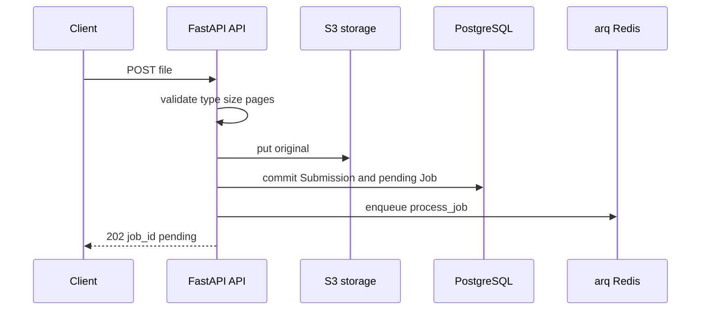

# HTTP API and Submission Admission

`main.py` registers three routers and a single `ApiError` handler. All `/v1` endpoints require `Authorization: Bearer <API_KEY>` via `api/deps.py:require_api_key`; comparison is constant-time. Errors use `{"error":{"code","message"}}` from `api/errors.py`.

| Endpoint | Owner | Success | Contract |
| --- | --- | --- | --- |
| `POST /v1/submissions` | `create_submission` | `202` `SubmissionAccepted` | multipart `file`; accepts PDF, PNG, JPEG, WebP and queues a pending job |
| `GET /v1/jobs/{job_id}` | `get_job` | `200` `JobResult` | returns job status and documents with fields only for extracted/review-needed extraction states |
| `POST /v1/documents/{document_id}/review` | `review_document` | `200` `DocumentResult` | resolves a reviewable document according to its current state |
| `GET /health` | `main.py:health` | `200` or `503` | reports PostgreSQL, Redis, and bucket probes; see [operations](../operations/runtime-and-validation.md) |

## Submission admission is ordered, not atomic

`create_submission` makes an explicit cross-service handoff. First it validates content type, non-empty bytes, configured size, and page count (without rasterizing PDFs). Only then it executes these steps:

This is the actual `api/submissions.py` ordering: original key `submissions/{submission_id}/original`, then a committed `Submission` and one-to-one pending `Job`, then `enqueue_job("process_job", str(job.id))`.

There is no distributed transaction or compensating cleanup. Consequently, a storage failure prevents the DB commit; a DB failure can leave an uploaded orphan; and an enqueue failure after commit can leave a visible pending job without a queued task. Do not casually reorder these calls: the worker assumes a committed job has a stored original, and the successful API response is only sent after enqueueing. `tests/test_submission_limits.py` verifies rejected size/page submissions create no job; the end-to-end tests validate the accepted path with real queue infrastructure.

## Request validation and results

`rendering.py` treats images as one page and opens PDFs with pypdfium2 for count validation. Limits are `Settings.max_submission_size_bytes` and `max_submission_pages`, defaulting to 50 MiB and 200. Unsupported/empty/unreadable input is `400 invalid_submission`; limit errors are `submission_too_large` and `submission_too_many_pages`. A missing/malformed/wrong bearer value is `401 unauthorized`; unknown jobs/documents are `404 not_found`.

`JobResult.from_job` serializes documents in relationship order. `DocumentResult` intentionally exposes `fields` only in `extracted` and `extraction_needs_review`; a validation failure or classification state is not represented as an empty successful extraction.

## Review contract

Only `classification_needs_review`, `extraction_needs_review`, and `extraction_failed` are resolvable; any other status returns `409 conflict`.

- For classification review, the caller must explicitly include `document_type`. A registered type sets its latest version and changes the document to `classified`, then queues `extract_document`; `null` confirms `unclassified` and clears type, version, and classification confidence.
- For extraction review, the caller must include a complete `fields` replacement object. `_resolve_extraction` validates it against the document's already-bound schema. It deletes prior fields only after validation succeeds, writes replacements with confidence `1.0`, and sets `extracted`; invalid replacement values leave/set `extraction_failed` with no model retry.

The review endpoint does not run extraction inline and never reopens a completed job. See [review and recovery](../pipeline/review-and-recovery.md) for status consequences and focused tests (`test_confidence_review.py`).

## Change checklist

For a public endpoint change, update implementation and router registration, Pydantic DTO conversion in `api/dto.py`, `ApiError` mapping if applicable, the authenticated consumer path, and focused ASGI tests. Validate the smallest affected route suite, e.g. `uv run pytest tests/test_submission_limits.py` or `uv run pytest tests/test_confidence_review.py`; use `tests/test_walking_skeleton.py` for the full public submit → worker → poll path.
