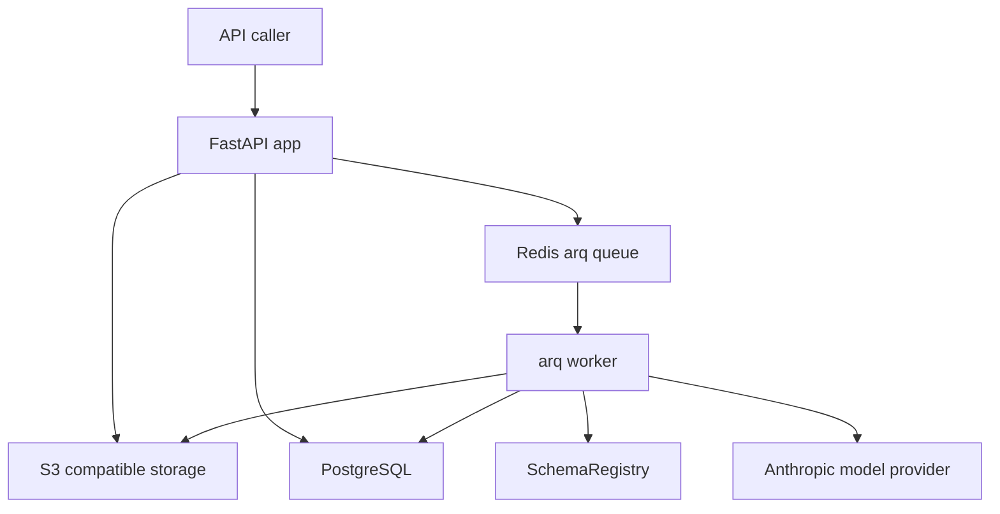

# System Architecture

This is a single Python service deployed as two processes: a FastAPI API accepts documents and exposes results, while an `arq` worker executes the asynchronous pipeline. PostgreSQL holds lifecycle and extraction records, Redis carries tasks, and S3-compatible storage holds originals and rendered page images. The schema directory is executable configuration: it supplies both classification candidates and extraction validation contracts.

The diagram shows the production boundary composed by `main.py` and `worker.py`.

## Composition roots and ownership

| Concern | Entrypoint / owner | Boundary |
| --- | --- | --- |
| HTTP service | `document_intelligence.main:app` | router registration, API lifespan opens an arq Redis pool, `/health` probes dependencies |
| Background service | `document_intelligence.worker.WorkerSettings` | starts S3 client, DB session factory, `RetryingModelProvider(AnthropicModelProvider(...))`, and one loaded `SchemaRegistry` |
| Public workflow | `api/submissions.py:create_submission` → `pipeline.py:process_job` | API persists/enqueues; worker renders, classifies, extracts, and persists |
| Human correction | `api/documents.py:review_document` → `worker.py:extract_document` | review resolves an eligible document; classification corrections enqueue extraction |
| Durable model | `db/models.py` | submission/job/document/page/field/model-call records; see [persistence](../data/persistence.md) |
| Policy input | `schema_registry/registry.py` and `schemas/` | registry maps type/version to JSON Schema and confidence threshold; see [schema authoring](../schemas/registry-and-authoring.md) |

## Main flow and architectural rules

A caller submits a PDF or PNG/JPEG/WebP. The API rejects invalid, oversized, or over-page-limit input before creating a job. For an accepted file it stores the original, commits a pending `Submission` and one-to-one `Job`, then enqueues `process_job`. That handoff is intentionally across separate systems, not a distributed transaction; its concrete ordering and implications belong to the [HTTP API page](../api/http-api.md).

The worker loads that job and makes documents from contiguous page groups. It does not use an OCR subsystem: page image bytes go directly to the model provider. Page classification is only a segmentation hint; whole-group classification chooses the authoritative type and schema version. Extraction then validates model values against that exact version. The [processing pipeline](../pipeline/processing.md) is the canonical behavioral specification.

Important boundaries are deliberate:

- **Job vs. Document outcome:** `JobStatus.failed` means worker execution exhausted attempts. A document can be `extraction_failed` or need review while its job is still `complete`.
- **Schema binding:** automated classification binds a document to a returned schema version. Review extraction validates against that existing version, not latest.
- **At-least-once tasks:** terminal jobs and documents no-op when redelivered; completed leading documents are preserved across retries.
- **No hidden state:** originals/pages reside in object storage; lifecycle and fields reside in PostgreSQL; Redis is transport, not the source of truth.

## High-value navigation

- Change routes, auth, response shapes, or admission ordering: [HTTP API](../api/http-api.md).
- Change classification, extraction, review routing, or recovery semantics: [processing](../pipeline/processing.md) and [review/recovery](../pipeline/review-and-recovery.md).
- Add/change a vendor implementation or retry behavior: [model provider](../model-provider/adapter-and-retries.md).
- Change schema types or confidence gates: [registry and authoring](../schemas/registry-and-authoring.md).
- Start services or diagnose dependencies: [runtime and validation](../operations/runtime-and-validation.md).
