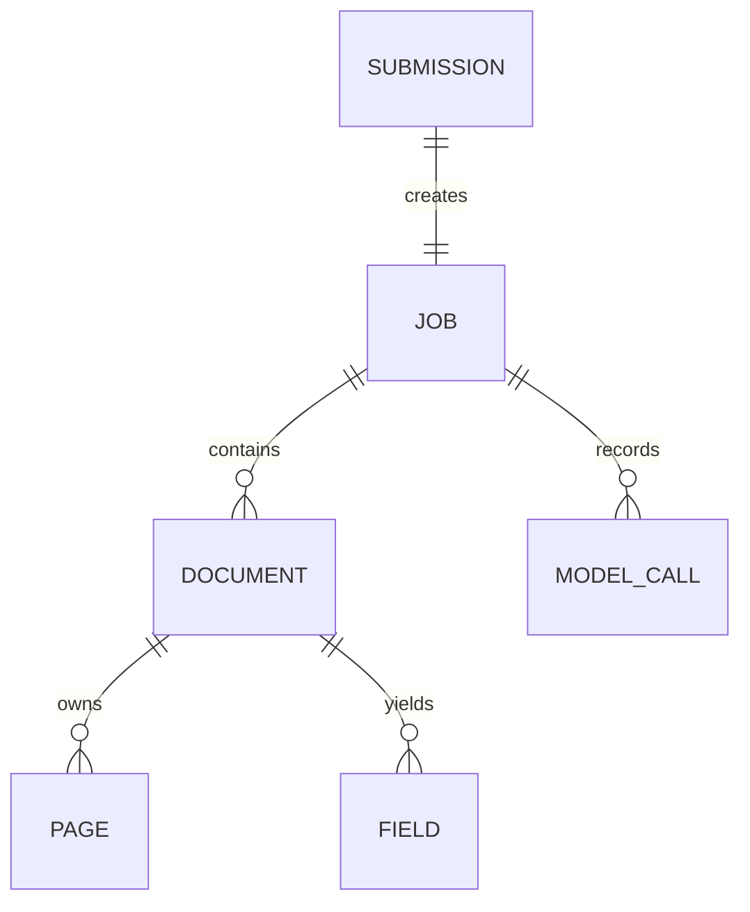

# Persistence, Storage, and Migrations

`db/models.py` is the durable lifecycle model. SQLAlchemy async sessions come from `db/session.py`; Alembic targets `Base.metadata` in `migrations/env.py`. PostgreSQL is authoritative for statuses and results, while S3-compatible storage owns input and page bytes.

These are the ORM relationships in `db/models.py`; `Field.value` is JSONB and page/original bytes are external storage objects.

## Entity ownership and invariants

| Entity | Key fields / invariant | Writer |
| --- | --- | --- |
| `Submission` | content type and original `storage_key` | submission endpoint |
| `Job` | unique `submission_id`, status, durable `attempt_count` | endpoint creates; pipeline/reconciler transitions |
| `Document` | status, optional type/version/confidence; a job's documents are a complete ordered page partition | pipeline and review endpoint |
| `Page` | page number is one-indexed *within document*; storage key/media type | pipeline |
| `Field` | name, JSONB value, per-field confidence | validated extraction or accepted review replacement |
| `ModelCall` | job, call type, prompt/response, nullable tokens, latency | `PersistingModelCallRecorder` |

Foreign-key columns are `jobs.submission_id → submissions.id`, `documents.job_id → jobs.id`, and `pages.document_id`, `fields.document_id` → documents.id`, plus `model_calls.job_id → jobs.id`. `jobs.submission_id` is the explicit unique constraint; the model declares no other uniqueness constraint. Job/document status and model-call type are validated string-backed enums, while `fields.value` is JSONB. Document/page and job/model-call relationships are ordered by creation/page number as declared in the ORM.

Document `classification_confidence` is null when no type remains (unclassified or unresolved provider exhaustion). A job can be `failed` while previously committed documents remain readable. Fields are only publicly emitted in extracted/review-needed extraction statuses. Detailed state logic belongs to [processing](../pipeline/processing.md) and [recovery](../pipeline/review-and-recovery.md).

## Storage contract

The API writes an original at `submissions/{submission_id}/original`. The worker writes rendered pages at `submissions/{submission.id}/pages/{page_number}`, preserving image media type. `storage.py` uses an aioboto3 client configured for path-style addressing, required by MinIO/self-hosted S3. It exposes only `put_object` and `get_object_bytes`; callers own key conventions. Do not change key shapes without considering retained objects, retry reuse, and tests using actual MinIO.

## Migrations and operational data changes

Migrations are ordered under `migrations/versions/`; the initial relational tables originate in `d00288b80d66`, `de9a04b19af1` adds model calls, and subsequent revisions add classification confidence and job attempts/failed status. Apply with `uv run alembic upgrade head`; create a revision with `uv run alembic revision -m "description"`. The Compose `migrate` service must finish before API/worker start.

When changing a persisted model, update ORM model, migration, API serialization where visible, pipeline/review writers, test cleanup (`tests/conftest.py` truncates all tables), and focused lifecycle tests. The migrations do not own schema registry JSON: that is file-based policy described in [schema authoring](../schemas/registry-and-authoring.md).
