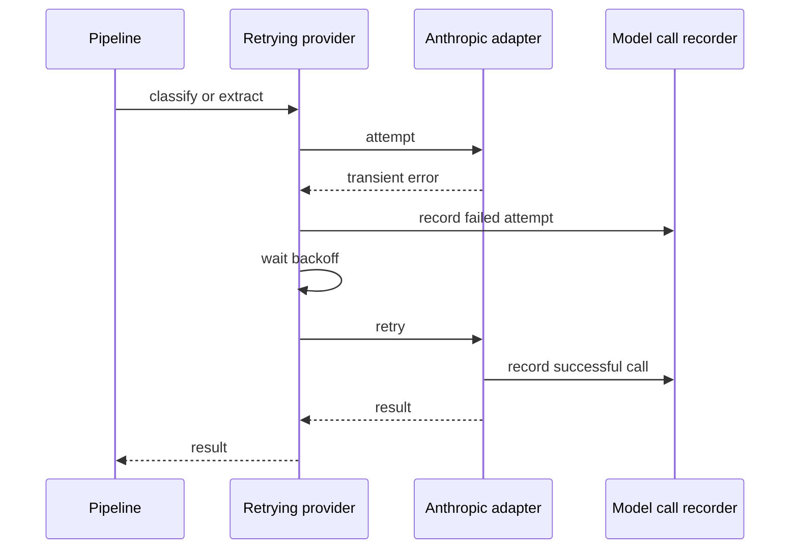

# Model Provider Adapter and Retry Policy

The pipeline depends only on `model_provider/protocol.py:ModelProvider`. All operations are asynchronous: `classify_page(Page, Sequence[DocumentTypeSchema]) -> PageClassification`; `classify_document(Sequence[Page], Sequence[DocumentTypeSchema]) -> DocumentClassification`; and `extract(Sequence[Page], DocumentTypeSchema, validation_errors: Sequence[str] | None = None) -> ExtractionResult`. `Page` carries image bytes/media type; `DocumentClassification` carries nullable type/version/confidence; an `ExtractionResult` is a tuple of named `ExtractedField` values with individual confidence. This is the vendor extension seam; pipeline logic must not import a vendor SDK.

## Production adapter

`AnthropicModelProvider` sends page images as base64 image content to the Anthropic Messages API, appends a task prompt, and forces one tool call. The three tool builders deliberately differ:

- `classify_page` requests only a match/type for grouping boundaries.
- `classify_document` requests match, type, schema version, and self-reported confidence.
- `extract_fields` mirrors schema properties, wrapping every emitted value with `value` and `confidence`. Its required list comes from the source schema's `required`, not all properties, so optional fields can be absent.

The adapter maps connection errors, HTTP 429 (including `Retry-After`), and 5xx into `TransientProviderError`; other API errors and malformed/missing forced-tool output propagate. It does not OCR or normalize document values itself. Schema descriptions are part of its classification/extraction guidance; see [schema registry and authoring](../schemas/registry-and-authoring.md).

## Retry and outcome routing

`RetryingModelProvider` wraps the adapter once at worker startup. It makes at most three total attempts for every protocol method, uses exponential jitter from roughly one second capped at ten seconds, and honors a provider `retry_after` exactly. It rethrows exhaustion; the pipeline decides the context-specific outcome: exhausted document classification becomes `classification_needs_review`, exhausted extraction becomes `extraction_needs_review`, while page-classification exhaustion is an ordinary task exception.

The sequence reflects `retry.py`, provider-side `report_model_call`, and the recorder set by the pipeline.

## Observability and extension surface

`recording.py` holds a context-local `ModelCallRecorder`; `process_job` and review-triggered extraction bind `PersistingModelCallRecorder(job_id)` for their duration. Successful adapters report prompt, serialized response, tokens, and latency. The retry wrapper records failed transient attempts because the inner provider did not produce a normal record. `observability.py` commits each `ModelCall` in an independent session so it remains inspectable if later document persistence fails; `job_token_usage` sums nullable tokens as zero.

To add a provider: implement all protocol methods and output exact value objects; map retryable vendor errors to `TransientProviderError`; call `report_model_call` on each successful vendor attempt with available usage; wire the wrapper/provider in `worker.startup`; and add contract tests alongside `test_model_provider_contract.py`. `FakeModelProvider` is the deterministic test double and supports scripted results, transient errors, and per-document-type extraction for concurrent groups.

Focused checks: `uv run pytest tests/test_model_provider_contract.py tests/test_model_provider_anthropic.py tests/test_transient_retry.py tests/test_observability.py`.
