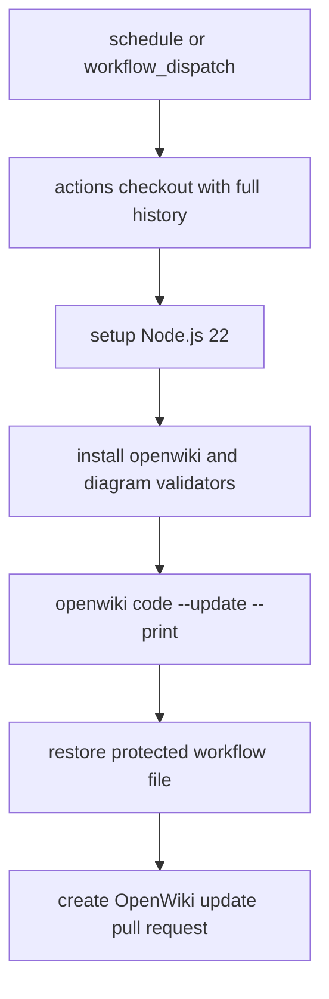

# OpenWiki Maintenance Workflow

`.github/workflows/openwiki-update.yml` owns repository documentation automation, not the document-processing runtime. It runs the `OpenWiki Update` GitHub Actions workflow on a daily schedule and by `workflow_dispatch`, executes `openwiki code --update --print`, then opens a pull request for generated documentation changes.

This flow shows the workflow steps in `.github/workflows/openwiki-update.yml`; it does not start the FastAPI or worker services described in [runtime configuration and validation](runtime-and-validation.md).

## Provider and runtime configuration

The workflow installs `openwiki@0.3.0` plus Mermaid validation packages with npm after `actions/setup-node` prepares Node 22. OpenWiki runs with `OPENWIKI_PROVIDER: openai`, `OPENAI_API_KEY: ${{ secrets.OPENAI_API_KEY }}`, and `OPENWIKI_MODEL_ID: gpt-5.5`. `OPENWIKI_TELEMETRY_DISABLED` is set to `"1"` in the workflow environment.

The checkout step uses `fetch-depth: 0` because OpenWiki's update mode compares current `HEAD` with the `gitHead` recorded in `openwiki/.last-update.json`; a shallow clone can hide that prior commit and produce an empty or misleading change summary.

## Protected workflow guard

After OpenWiki runs, the workflow executes `git checkout -- .github/workflows/openwiki-update.yml` with `if: always()`. The inline source comment says this guard exists because `openwiki code --update` regenerates the workflow from an internal template and can drop local protections. Keep that restore step when editing provider settings, action pins, or pull-request behavior unless the upstream issue referenced in the workflow is resolved and the replacement behavior is verified.

The pull-request step uses `peter-evans/create-pull-request` and is configured to add `openwiki`, `AGENTS.md`, `CLAUDE.md`, and `.github/workflows/openwiki-update.yml`. In normal documentation runs, repository guidance still keeps generated content under `openwiki/`; the restore guard prevents the OpenWiki agent's regenerated workflow content from becoming an unintended PR diff.

## Change navigation

| Intent | Start here | Narrow validation |
| --- | --- | --- |
| Change the model provider, model ID, telemetry flag, or API-key secret name for documentation updates | `.github/workflows/openwiki-update.yml` `Run OpenWiki` step | `gh workflow run openwiki-update.yml` |
| Change Node/OpenWiki installation or action pins | `.github/workflows/openwiki-update.yml` checkout, setup-node, install, and create-pull-request steps | `gh workflow run openwiki-update.yml` |
| Modify how generated documentation PRs are published | `.github/workflows/openwiki-update.yml` `Create OpenWiki update pull request` step | Confirm the workflow-created PR only contains intended paths |
| Remove or change the restore guard | `.github/workflows/openwiki-update.yml` `Restore protected workflow file` step | Trigger the workflow and inspect that the resulting diff preserves local workflow protections |

Escalate to the application [runtime and validation guide](runtime-and-validation.md) only if the documentation workflow change also alters service startup, dependency health, or test execution. Otherwise, this CI workflow is independent of the FastAPI, arq, PostgreSQL, Redis, MinIO, schema, and model-provider runtime boundaries summarized in the [system architecture](../architecture/overview.md).
