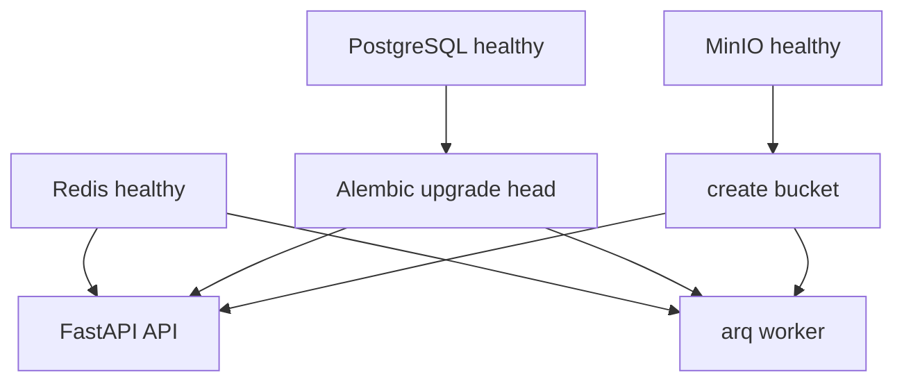

# Runtime Configuration and Validation

## Runtime topology and startup ordering

`Dockerfile` starts `uvicorn document_intelligence.main:app`. Compose runs PostgreSQL, Redis, MinIO, a bucket-creation one-shot service, an Alembic migration one-shot service, API, and worker; RedisInsight is optional tooling. API and worker wait for healthy Postgres/Redis plus successful bucket creation and migrations. The worker command is `arq document_intelligence.worker.WorkerSettings` and additionally requires the Anthropic credential; the API does not.

This is the Compose `depends_on` chain, not a claim that the API depends on worker availability.

## Settings, cache, and role boundaries

`Settings` in `config.py` uses pydantic-settings with `.env` and environment variables; `get_settings()` is `lru_cache`d. Environment values override file/default values under normal BaseSettings behavior. Tests that mutate settings clear the cache; a long-lived process will not observe changed settings without cache clearing/restart.

- **API:** loads settings for Redis lifespan, submission limits, API bearer key, S3 dependencies, and health. `get_schema_registry` intentionally loads the registry per request, allowing a test/config override without restarting API lifespan.
- **Worker:** `startup` loads settings once, creates S3/session/provider dependencies, and loads one registry into `PipelineDeps`; changing schema files/config requires worker restart to affect automated jobs.
- **Evaluation:** uses `Settings` but separately calls `load_dotenv()` because `anthropic.AsyncAnthropic()` reads the process environment directly.

Do not place real credentials in documentation or source. `API_KEY` is the single-tenant bearer secret checked by API dependencies; `ANTHROPIC_API_KEY` is required only for the real worker/evaluation provider. `.env.example` provides placeholder/development configuration. S3 endpoint/access/secret/bucket/region, database/Redis URLs, registry path, limits, and stale-job timeout are settings; see [architecture](../architecture/overview.md) for their consumers.

## Operations and health

Start the complete development stack with `docker compose up -d`; `/health` concurrently executes `SELECT 1`, Redis `PING`, and S3 `head_bucket`, returning `200 ok` only if all pass and `503 degraded` with per-dependency errors otherwise. Apply migrations with `uv run alembic upgrade head` (Compose does this before app services). For a local app process, use `uv sync`, bring up dependencies, migrate, then run Uvicorn and the arq worker separately as described in README.

The worker schedules `reconcile_stuck_jobs` at startup and by cron. It closes its S3 context stack on shutdown. Recovery semantics are in [review and recovery](../pipeline/review-and-recovery.md).

## Validation routing

| Intent | Focused command |
| --- | --- |
| Full deterministic suite | `uv run pytest` |
| API submit/poll/auth | `uv run pytest tests/test_walking_skeleton.py tests/test_submission_limits.py` |
| Pipeline lifecycle/recovery | `uv run pytest tests/test_job_failure.py tests/test_pipeline_idempotency.py tests/test_stuck_job_reconciliation.py` |
| Provider contract/retry/records | `uv run pytest tests/test_model_provider_contract.py tests/test_transient_retry.py tests/test_observability.py` |
| Registry/schema/fixture drift | `uv run pytest tests/test_schema_registry.py tests/test_fixture_renderer.py` |
| Manual complete-stack smoke | `uv run python scripts/manual_test.py` |
| Paid real-provider accuracy | `uv run python eval/run_eval.py` |

`tests/conftest.py` flushes the shared Redis database and truncates PostgreSQL tables after tests; run against the established local development infrastructure, not an environment with data you need to preserve.
