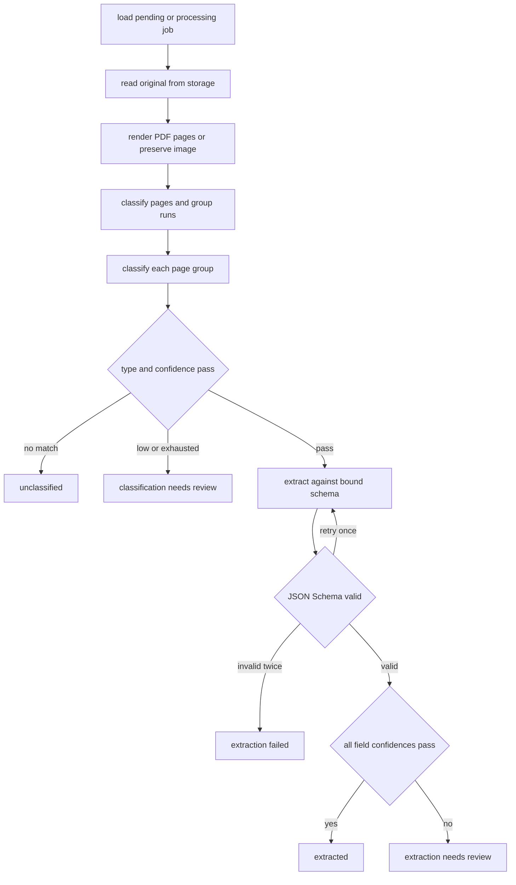

# Processing Pipeline

`pipeline.py:process_job` is the worker's core. It receives `PipelineDeps` built in `worker.py`: a fresh-session factory, S3 client/bucket, a `ModelProvider`, and a `SchemaRegistry`. It processes a `Job` into an ordered complete partition of `Document` records.

This diagram summarizes `_classify_and_extract_group` and `_run_extraction`; documents are persisted after each group in page order.

## Rendering and two-phase classification

`render_pages` rasterizes every PDF page to PNG at 144 DPI and leaves an input image unchanged. It uploads each not-already-covered page under `submissions/{submission.id}/pages/{page_number}`. Multi-page work calls `ModelProvider.classify_page` concurrently, then `group_pages_into_documents` groups *contiguous equal document-type names*, including `None`. Every input page belongs to exactly one boundary. A single remaining page skips page classification and creates a trivial boundary.

Page classification only finds boundaries. Each group is independently reclassified with `classify_document`; this second result is authoritative for document type and schema version. Different groups compute concurrently, but classification then extraction is sequential within a group because extraction requires the bound schema. `tests/test_multi_page_splitting.py` proves group boundaries, unclassified runs, whole-document reclassification, and multi-page non-fragmentation.

## Extraction and confidence

For a matched classification, the registry lookup of the returned name/version supplies the JSON Schema and per-type threshold.

- A confidence below threshold becomes `classification_needs_review`, retaining type/version/confidence but making no extraction call.
- `extract` receives all group page images, that schema, and optional all-at-once validation errors from a prior attempt.
- `extraction_validation_errors` validates the field-name/value map via `jsonschema`; it retries exactly once. A second invalid result becomes `extraction_failed`.
- A valid result is `extracted` only when every field confidence meets the type threshold; otherwise fields are persisted and status is `extraction_needs_review`.
- Exhausted transient document classification/extraction errors become the respective review status rather than failing the job. Provider policy is documented in [model provider](../model-provider/adapter-and-retries.md).

`test_extraction_validation.py` pins the retry budget and error feedback; `test_confidence_review.py` pins confidence gate behavior.

## Idempotency and commit ordering

At task start, terminal jobs (`complete` or `failed`) no-op. Otherwise `attempt_count` increments durably and a pending job becomes processing. `already_covered = sum(len(document.pages) for document in job.documents)` maps the committed leading documents to the original one-indexed rendered page sequence: pages at or below that count are neither uploaded nor sent to a provider on retry. Each computed group is committed immediately in page order. Provider work is concurrent only while it is side-effect-free: `asyncio.gather` computes page classifications and then each group outcome, because one `AsyncSession` is not safe for concurrent mutation; only the sequential apply loop creates documents/pages/fields and commits. If an outcome is an exception, that exception is explicitly re-raised before applying it or any later outcome, so only already committed leading groups survive.

A final conditional SQL update changes only still-`processing` jobs to `complete`, preventing a concurrent reconciliation failure from being overwritten. Model-call recording is bound in a `ContextVar` for the job and reset in `finally`; it writes independently so calls survive later rollback. See [persistence](../data/persistence.md) and [review/recovery](review-and-recovery.md).

Use `tests/test_pipeline_idempotency.py` and `tests/test_job_failure.py` after changing retry/commit behavior. The full queue-facing check is `uv run pytest tests/test_walking_skeleton.py tests/test_multi_page_splitting.py`.
