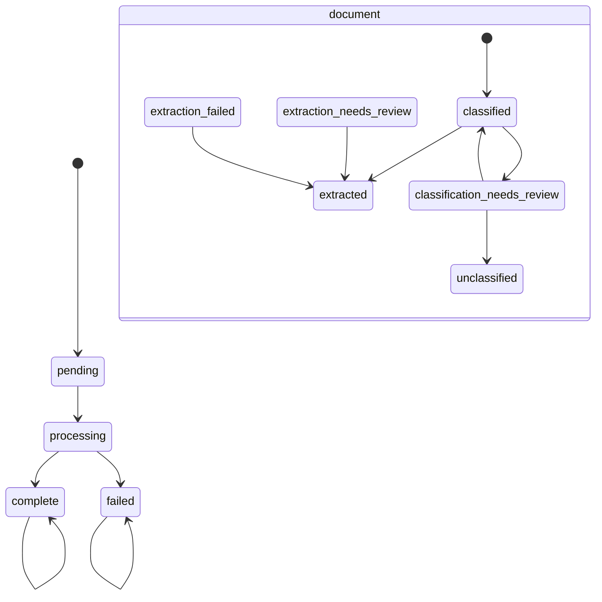

# Review, Failure, and Recovery

The system separates a **job execution failure** from a **document interpretation outcome**. `JobStatus` is `pending → processing → complete|failed`. `DocumentStatus` includes `unclassified`, two review states, `extracted`, and `extraction_failed`. Thus a job completes when pipeline execution finishes even if one document needs review or has invalid extraction output.

The job states come from `db/models.py`; document review transitions are implemented by `api/documents.py` and asynchronous extraction by `pipeline.py`.

## Human review is caller-owned

`review_document` accepts only the three resolvable document statuses. A classification reviewer either chooses a registered type or explicitly confirms unclassified. Choosing a type binds its latest schema version and enqueues `extract_document`; the queued task only acts while the document remains `classified`, so redelivery is safe. It reads the document's persisted page images and calls `extract_and_validate`. The job remains terminal if it already completed.

For extraction review, the caller sends a whole replacement set, not a patch. Validation uses the document's currently bound type/version. Valid values replace all `Field` rows and receive confidence `1.0`; invalid values set/retain `extraction_failed` and do not invoke the provider. This prevents reviewer corrections from silently bypassing schema validity while preserving the ADR-0003 stateless-review design. API body/status requirements and error codes are in [HTTP API](../api/http-api.md).

## Task attempts and durable failure

`process_job` stores attempts in PostgreSQL rather than trusting `arq` retry metadata. `_MAX_JOB_ATTEMPTS` is 5, matching arq's default. Exceptions propagate so arq can redeliver; at the fifth application-level attempt, `mark_job_failed` opens a fresh session and transitions only a nonterminal job. This fresh-session implementation is important: an exhausted attempt may have left its own session/transaction unusable.

Completed documents remain visible if a later group repeatedly fails. Redelivered complete or failed jobs do nothing; resumed processing skips persisted leading pages. `tests/test_job_failure.py` asserts all three: durable failed state, retained earlier document, and no repeated provider calls.

## Hard-crash reconciliation

A process kill/OOM can happen after the attempt count/status commit but before `process_job`'s exception handler. Once arq declines a task beyond its retry limit, no application coroutine may run to mark the job failed. `worker.py` therefore registers `reconcile_stuck_jobs` as an arq cron task, also run at worker startup.

The sweep selects only jobs that are still `processing`, have at least 5 attempts, and have `updated_at` older than configured `job_stale_after_seconds` (default 300). It computes the cutoff as current UTC with timezone removed because Postgres stores `updated_at` as a naive timestamp and asyncpg rejects a timezone-aware comparison. It then calls the same idempotent `mark_job_failed` per ID. The staleness condition intentionally avoids treating a genuinely in-flight final attempt as abandoned. The final processing update is conditional, so a sweep that marks a job failed mid-attempt cannot be silently reversed to complete. `tests/test_stuck_job_reconciliation.py` covers qualifying/nonqualifying and concurrent-failure cases.

## Safe changes and validation

Do not merge document and job terminal status concepts, make review inline, or alter retry limits in only one of application/arq assumptions. For review changes run `uv run pytest tests/test_confidence_review.py`; for recovery changes run `uv run pytest tests/test_job_failure.py tests/test_pipeline_idempotency.py tests/test_stuck_job_reconciliation.py`.
