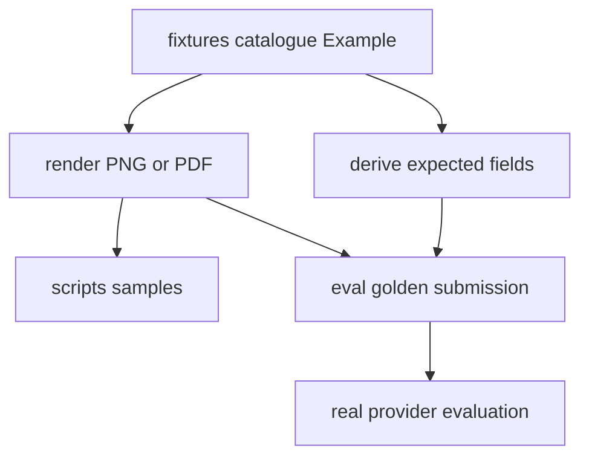
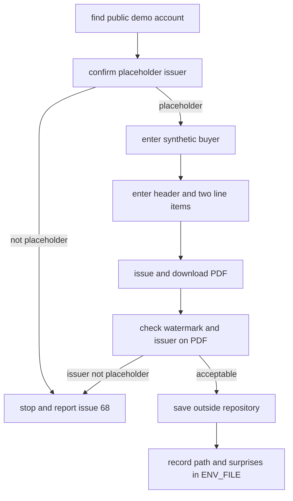

# Synthetic Fixtures and Golden Evaluation

The repository has two complementary quality systems. `tests/` uses `FakeModelProvider` and real API/queue/database/storage infrastructure for deterministic assertions. `eval/run_eval.py` runs the real Anthropic provider against generated golden documents and reports accuracy because model responses are probabilistic and billed.

## One authoring model, two generated surfaces

`fixtures/catalogue.py:EXAMPLES` is the canonical table of `Example` objects. An example carries its document type/version, `Submission` faces, `Row`/`Table`/`Mrz`-like elements, declared absent fields, and optional golden/sample destinations. The renderer builds a visual document; expectation projection reads values from the same element arguments. Therefore rendered evidence and `expected.json` are co-derived rather than separately maintained.

The diagram reflects `fixtures/generate.py`, `fixtures/surfaces.py`, and expectation/render functions.

### Semantic rules

- Give each printed evidence value a keyword named for the schema field; list deliberately unprinted top-level values in `absent` so they project as `null` when schema semantics permit.
- `Table.into` projects nested arrays. Each nested property required by the schema must be represented; a missing printed column uses explicit `null`, not a missing key. This matters for invoice line items and VAT summaries.
- Use `fixtures.identifiers`, never realistic hand-written identifiers. It creates correctly shaped but deliberately invalid check-digit values, including ICAO-style MRZ check digits, avoiding accidental real identifiers while retaining extraction realism.
- MRZ names are transliterated inside `fixtures.identifiers`: Hungarian letters with one ICAO Doc 9303 §6.A mapping become A-Z (`Á→A`, `Ő→O`, `Ű→U`), spaces/hyphens become `<`, apostrophes are dropped, and state-dependent characters such as `Ö`/`Ü` raise `AmbiguousTransliteration` instead of guessing. Fixture names must be chosen so the zone is evidence-backed.
- The renderer refuses overflowing headings/cells/faces (`FixtureDoesNotFit`) and uses vendored DejaVu fonts so Hungarian accented text is distinguishable. `fixtures/render.py` still has only shared `card` and `sheet` geometry; the current identity-document research shows that eID and address-card label placement is mixed per row/face, so fidelity changes need a layout model richer than one placement per document type.

Run `uv run python -m fixtures.generate` after data-table changes. It overwrites manual samples in `scripts/samples/` and golden submissions plus `expected.json` under `eval/golden/`. Do not edit generated image or expectation output independently. Generated samples are the inputs used by the manual smoke path in [runtime configuration and validation](../operations/runtime-and-validation.md).

`tests/test_fixture_renderer.py` verifies projection semantics, nested nulls, synthetic identifier invalidity, MRZ transliteration/refusal behavior, font/layout determinism, schema conformance through the [schema registry](../schemas/registry-and-authoring.md), and committed sample/golden drift. Run `uv run pytest tests/test_fixture_renderer.py` for fixture/schema change validation.

## External reference collection

`scripts/issue_demo_invoice_wizard.sh` is a human-guided Számlázz.hu demófiók workflow for collecting an external invoice layout reference, not a runtime dependency and not a generator for committed fixtures. It opens the public demo, checks that the issuer is clearly a placeholder before any invoice is issued, enters the same synthetic buyer and 27% line items used by the `invoice/happy_path` fixture, verifies the downloaded PDF, and asks the operator to save that PDF outside the working tree under `$HOME/document-intelligence-reference/invoices/`.

The diagram follows the seven stages in `scripts/issue_demo_invoice_wizard.sh`.

The wizard writes observations such as `DEMO_URL`, `ISSUER_NAME`, `ISSUER_TAX`, `WATERMARK`, `PDF_PATH`, and `SURPRISES` to `ENV_FILE` (defaulting outside the repo). Treat those values as research notes for fixture/layout decisions; do not read them as application configuration, and do not commit downloaded provider PDFs until the product/research decision that owns provider-PDF licensing and provenance says to do so. The focused validation for changes to the wizard is shell syntax plus a careful dry run of its stages; fixture correctness still lands through `uv run pytest tests/test_fixture_renderer.py`.

## Change navigation

| Intent | Start here | Important symbols and invariants | Focused validation |
| --- | --- | --- | --- |
| Add or revise a synthetic example | `fixtures/catalogue.py` and the `fixtures` public exports in `fixtures/__init__.py` | `Example`, `Submission`, `Face`, `Row`, `Table`, `Mrz`; every asserted field must come from printed evidence or explicit `absent`/`absent_keys` | `uv run pytest tests/test_fixture_renderer.py` |
| Change identifier or MRZ behavior | `fixtures/identifiers.py` | `_broken`, `tax_number`, `bank_account_number`, `mrz_td1`, `mrz_td3`, `AmbiguousTransliteration`; generated identifiers must remain unissuable and MRZ transliteration must stay evidence-backed | `uv run pytest tests/test_fixture_renderer.py -k "identifier or mrz or zone"` |
| Change renderer layout or fonts | `fixtures/render.py`, `fixtures/fonts.py`, `docs/research/hungarian-document-printed-labels.md` | `Geometry`, `CARD`, `SHEET`, `FixtureDoesNotFit`; no clipped/overflowing value may be rendered while still appearing in expectations | `uv run pytest tests/test_fixture_renderer.py -k "fits or font or cell or column or rendered"` |
| Regenerate committed surfaces | `fixtures/generate.py`, `fixtures/surfaces.py` | samples under `scripts/samples/`; golden submissions and `expected.json` under `eval/golden/`; never hand-edit derived outputs | `uv run python -m fixtures.generate && uv run pytest tests/test_fixture_renderer.py` |
| Collect a real provider invoice layout reference | `scripts/issue_demo_invoice_wizard.sh` | stage gates for placeholder issuer, MINTA/watermark observation, outside-repo `PDF_PATH`; the wizard is research support, not app config | `bash -n scripts/issue_demo_invoice_wizard.sh` plus a manual dry run when stage text changes |

## Golden evaluation

`eval/run_eval.py` discovers every `expected.json` recursively, requires exactly one adjacent supported `submission.*`, creates a temporary submission/job in real PostgreSQL/S3, and calls `process_job` directly with `RetryingModelProvider(AnthropicModelProvider)`. It then reloads that job with documents and fields for scoring. A fully correct example must produce exactly one document, match expected classification type/version, and match every listed expected field; top-level numeric values tolerate ±0.01, while other values (including nested structures) compare exactly. It prints type and field accuracy and exits nonzero if any example is not fully correct.

Run `uv run python eval/run_eval.py` only with infrastructure, migrations, and a configured Anthropic credential; it performs billed external calls. `--model` and `--golden-dir` are explicit overrides. The committed golden set currently covers invoice v2 happy/simplified examples; the evaluation README records planned identity-document examples. This harness is an accuracy report, not a deterministic replacement for tests.
