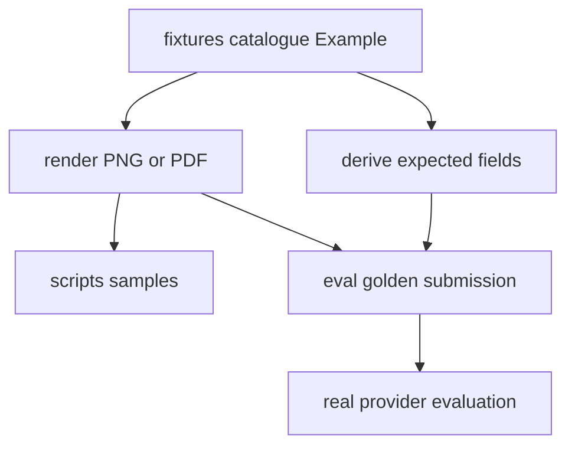

# Synthetic Fixtures and Golden Evaluation

The repository has two complementary quality systems. `tests/` uses `FakeModelProvider` and real API/queue/database/storage infrastructure for deterministic assertions. `eval/run_eval.py` runs the real Anthropic provider against generated golden documents and reports accuracy because model responses are probabilistic and billed.

## One authoring model, two generated surfaces

`fixtures/catalogue.py:EXAMPLES` is the canonical table of `Example` objects. An example carries its document type/version, `Submission` faces, `Row`/`Table`/`Mrz`-like elements, declared absent fields, and optional golden/sample destinations. The renderer builds a visual document; expectation projection reads values from the same element arguments. Therefore rendered evidence and `expected.json` are co-derived rather than separately maintained.

The diagram reflects `fixtures/generate.py`, `fixtures/surfaces.py`, and expectation/render functions.

### Semantic rules

- Give each printed evidence value a keyword named for the schema field; list deliberately unprinted top-level values in `absent` so they project as `null` when schema semantics permit.
- `Table.into` projects nested arrays. Each nested property required by the schema must be represented; a missing printed column uses explicit `null`, not a missing key. This matters for invoice line items and VAT summaries.
- Use `fixtures.identifiers`, never realistic hand-written identifiers. It creates correctly shaped but deliberately invalid check-digit values, including ICAO-style MRZ check digits, avoiding accidental real identifiers while retaining extraction realism.
- The renderer refuses overflowing headings/cells/faces (`FixtureDoesNotFit`) and uses vendored DejaVu fonts so Hungarian accented text is distinguishable.

Run `uv run python -m fixtures.generate` after data-table changes. It overwrites manual samples in `scripts/samples/` and golden submissions plus `expected.json` under `eval/golden/`. Do not edit generated image or expectation output independently.

`tests/test_fixture_renderer.py` verifies projection semantics, nested nulls, synthetic identifier invalidity, font/layout determinism, schema conformance, and committed sample/golden drift. Run `uv run pytest tests/test_fixture_renderer.py` for fixture/schema change validation.

## Golden evaluation

`eval/run_eval.py` discovers every `expected.json` recursively, requires exactly one adjacent supported `submission.*`, creates a temporary submission/job in real PostgreSQL/S3, and calls `process_job` directly with `RetryingModelProvider(AnthropicModelProvider)`. It then reloads that job with documents and fields for scoring. A fully correct example must produce exactly one document, match expected classification type/version, and match every listed expected field; top-level numeric values tolerate ±0.01, while other values (including nested structures) compare exactly. It prints type and field accuracy and exits nonzero if any example is not fully correct.

Run `uv run python eval/run_eval.py` only with infrastructure, migrations, and a configured Anthropic credential; it performs billed external calls. `--model` and `--golden-dir` are explicit overrides. The committed golden set currently covers invoice v2 happy/simplified examples; the evaluation README records planned identity-document examples. This harness is an accuracy report, not a deterministic replacement for tests.
