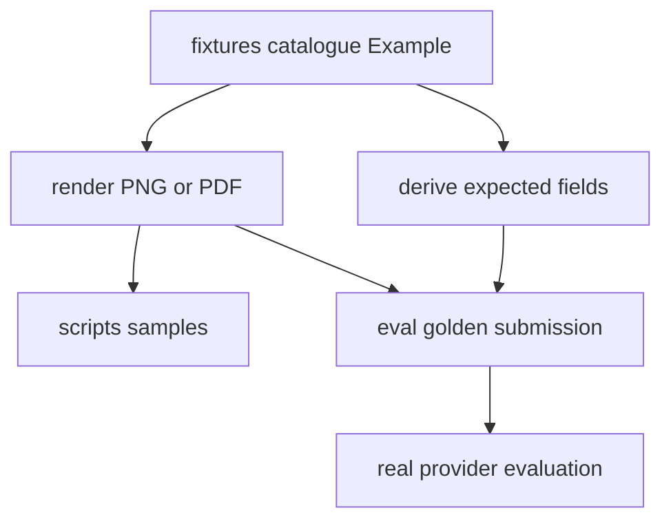

# Synthetic Fixtures and Golden Evaluation

The repository has two complementary quality systems. `tests/` uses `FakeModelProvider` and real API/queue/database/storage infrastructure for deterministic assertions. `eval/run_eval.py` runs the real Anthropic provider against generated golden documents and reports accuracy because model responses are probabilistic and billed.

## One authoring model, two generated surfaces

`fixtures/catalogue.py:EXAMPLES` is the canonical table of `Example` objects. An example carries its document type/version, `Submission` faces, `Row`/`Table`/`Mrz`-like elements, declared absent fields, and optional golden/sample destinations. The renderer builds a visual document; expectation projection reads values from the same element arguments. Therefore rendered evidence and `expected.json` are co-derived rather than separately maintained.

The diagram reflects `fixtures/generate.py`, `fixtures/surfaces.py`, and expectation/render functions.

### Semantic rules

- Give each printed evidence value a keyword named for the schema field; list deliberately unprinted top-level values in `absent` so they project as `null` when schema semantics permit.
- `Table.into` projects nested arrays. Each nested property required by the schema must be represented; a missing printed column uses explicit `null`, not a missing key. This matters for invoice line items and VAT summaries.
- Use `fixtures.identifiers`, never realistic hand-written identifiers. It creates correctly shaped but deliberately invalid check-digit values for Hungarian tax numbers, personal identifiers, bank account numbers, and ICAO-style MRZ fields, avoiding accidental real identifiers while retaining extraction realism.
- The renderer refuses overflowing headings/cells/faces (`FixtureDoesNotFit`) and uses vendored DejaVu fonts so Hungarian accented text is distinguishable.

Run `uv run python -m fixtures.generate` after data-table changes. It overwrites manual samples in `scripts/samples/` and golden submissions plus `expected.json` under `eval/golden/`. Do not edit generated image or expectation output independently.

`tests/test_fixture_renderer.py` verifies projection semantics, nested nulls, synthetic identifier invalidity, MRZ transliteration/refusal rules, font/layout determinism, schema conformance, and committed sample/golden drift. Run `uv run pytest tests/test_fixture_renderer.py` for fixture/schema change validation.

## MRZ and privacy identifiers

`fixtures/identifiers.py` centralizes identifier families that must look extractable but remain unissuable. `_broken` shifts every computed check digit by `_BREAK`, and tests prove that correcting only that digit would make the same shaped value valid. Do not bypass this helper for adószám, személyi azonosító, bank-account, or MRZ values in committed fixtures.

MRZ helpers add a second invariant: the zone alphabet is only `A-Z`, digits, and `<`. `_transliterate` now resolves Hungarian diacritics with a single ICAO Doc 9303 Part 3 §6.A recommendation (`Á`, `É`, `Í`, `Ó`, `Ő`, `Ú`, `Ű`) and converts spaces/hyphens to fillers while dropping apostrophes. Characters whose transliteration is state-dependent, including Hungarian `Ö` and `Ü`, raise `AmbiguousTransliteration` instead of guessing; fixture authors should choose a name without those letters unless a Hungarian source settles the issuing-state spelling.

Focused retrieval tests are named for the behavior they protect: `test_the_zone_transliterates_every_hungarian_diacritic_to_one_letter`, `test_the_zone_drops_an_apostrophe_without_leaving_a_filler`, and `test_the_zone_refuses_a_letter_9303_transliterates_more_than_one_way` in `tests/test_fixture_renderer.py`.

## Renderer fidelity boundaries

`fixtures/render.py` has two geometries: `CARD` for ID-1-like identity faces and `SHEET` for A4 invoice pages. Both are deliberately low-fidelity: text, simple layout, no photo, hologram, OVD, or security printing, and a `MINTA`/`SPECIMEN` wash. This supports deterministic extraction testing rather than visual forgery.

The current `CARD` geometry stacks label/value rows uniformly, which is an intentional simplification rather than a faithful Hungarian identity layout. `docs/research/hungarian-document-printed-labels.md` §6 records that real eID and address cards mix stacked, inline, right-aligned, and two-column placements on a single card face; the driving licence also has a rotated verso legend that the shared renderer cannot draw. Future fidelity work should not model label placement as a single per-document-type switch without re-reading that research note and the `fixtures/render.py` module docstring.

Manual third-party reference capture, when needed for invoice layout evidence, is documented separately in [manual reference capture](manual-reference-capture.md). That workflow can inform fixture authoring, but committed samples and golden examples still come from `EXAMPLES` and `fixtures.generate`.

## Golden evaluation

`eval/run_eval.py` discovers every `expected.json` recursively, requires exactly one adjacent supported `submission.*`, creates a temporary submission/job in real PostgreSQL/S3, and calls `process_job` directly with `RetryingModelProvider(AnthropicModelProvider)`. It then reloads that job with documents and fields for scoring. A fully correct example must produce exactly one document, match expected classification type/version, and match every listed expected field; top-level numeric values tolerate ±0.01, while other values (including nested structures) compare exactly. It prints type and field accuracy and exits nonzero if any example is not fully correct.

Run `uv run python eval/run_eval.py` only with infrastructure, migrations, and a configured Anthropic credential; it performs billed external calls. `--model` and `--golden-dir` are explicit overrides. The committed golden set currently covers invoice v2 happy/simplified examples; the evaluation README records planned identity-document examples. This harness is an accuracy report, not a deterministic replacement for tests.
