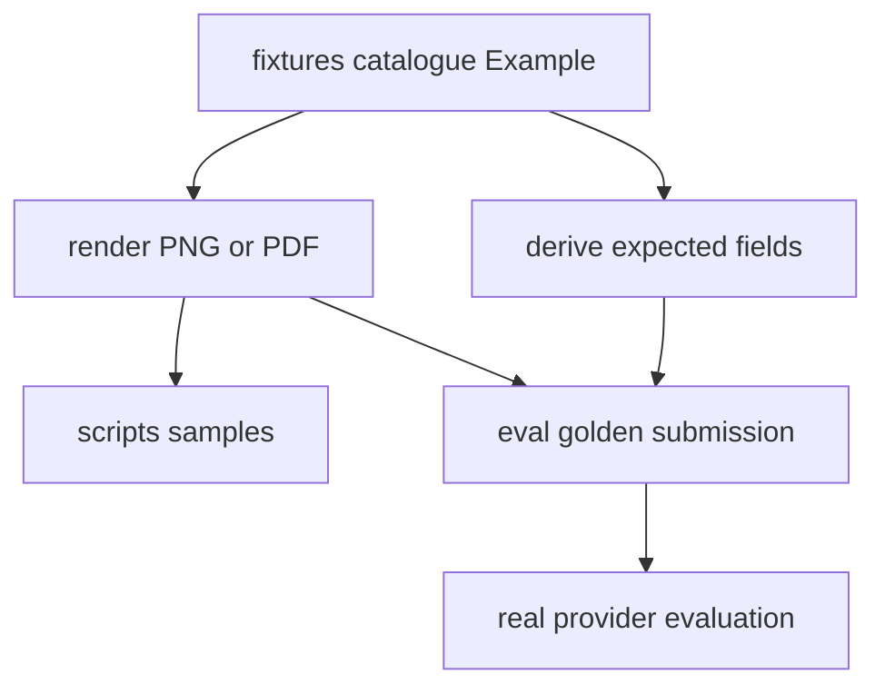

# Synthetic Fixtures and Golden Evaluation

The repository has two complementary quality systems. `tests/` uses `FakeModelProvider` and real API/queue/database/storage infrastructure for deterministic assertions, while `eval/run_eval.py` runs the real Anthropic provider against generated golden documents and reports accuracy because model responses are probabilistic and billed. The fixture system also feeds manual samples for the [HTTP API](../api/http-api.md), so fixture changes can affect both deterministic tests and the [processing pipeline](../pipeline/processing.md).

## One authoring model, two generated surfaces

`fixtures/catalogue.py:EXAMPLES` is the canonical table of `Example` objects. An example carries its document type/version, `Submission` faces, `Row`/`Table`/`Mrz` elements, declared absent fields, and optional golden/sample destinations. The renderer builds a visual document; expectation projection reads values from the same element arguments. Therefore rendered evidence and `expected.json` are co-derived rather than separately maintained.

The diagram reflects `fixtures/generate.py`, `fixtures/surfaces.py`, and expectation/render functions.

### Semantic rules

- Give each printed evidence value a keyword named for the schema field; list deliberately unprinted top-level values in `Example.absent` so they project as `null` when schema semantics permit.
- `Table.into` projects nested arrays. Each nested property required by the [schema registry](../schemas/registry-and-authoring.md) must be represented; a missing printed column uses `Table.absent_keys` so each row carries explicit `null`, not a missing key.
- Use `fixtures.identifiers`, never realistic hand-written identifiers. It creates correctly shaped but deliberately invalid check-digit values for adószám, személyi azonosító, Hungarian bank-account groups, and ICAO-style MRZ check digits, avoiding accidental real identifiers while retaining extraction realism.
- MRZ names are transliterated by `fixtures.identifiers` before drawing. `mrz_td1` and `mrz_td3` accept only the ICAO zone alphabet after transliteration; Hungarian letters with a single ICAO 9303 §6.A recommendation map one-to-one, hyphen/space become filler, apostrophe is dropped, and `AmbiguousTransliteration` refuses state-dependent choices such as `Ö` and `Ü` rather than guessing.
- The renderer refuses overflowing headings/cells/faces (`FixtureDoesNotFit`) and uses vendored DejaVu fonts so Hungarian accented text is distinguishable.

Run `uv run python -m fixtures.generate` after data-table changes. It overwrites manual samples in `scripts/samples/` and golden submissions plus `expected.json` under `eval/golden/`. Do not edit generated image or expectation output independently.

`tests/test_fixture_renderer.py` verifies projection semantics, nested nulls, synthetic identifier invalidity, personal-identifier hyphen grouping, ICAO check-digit weighting, MRZ transliteration/refusal behavior, font/layout determinism, schema conformance, and committed sample/golden drift. Run `uv run pytest tests/test_fixture_renderer.py` for fixture/schema change validation.

## Renderer fidelity boundary

`fixtures/render.py` has two geometries: `CARD` for ID-1-like identity documents and `SHEET` for A4-like invoices. `Geometry`, `Frame`, `_draw_elements`, and `_draw_table` intentionally model a small element vocabulary shared across document types, not a perfect per-document design system.

The current `CARD` geometry stacks labels uniformly. Current research in `docs/research/hungarian-document-printed-labels.md` shows this is lower fidelity: eID and address cards mix stacked, inline, right-aligned, and tab-stop placements on the same document, while the driving licence has a rotated verso legend that the renderer cannot draw. Treat that as a known fixture fidelity boundary. If a future change adds true placement support, it must update the `Geometry`/drawing seam, regenerate fixtures, and expand `tests/test_fixture_renderer.py` around the affected visual and expectation invariants.

## Manual reference-artifact workflow

`scripts/issue_demo_invoice_wizard.sh` is an interactive research workflow for issuing a synthetic Számlázz.hu demófiók invoice. It is not a deterministic test and it does not feed the runtime pipeline directly. The wizard opens the third-party UI, asks a human to verify that the issuer is a placeholder, uses synthetic buyer values that mirror `invoice/happy_path`, records observations in an `ENV_FILE`, and directs the downloaded PDF to `$HOME/document-intelligence-reference/invoices` by default rather than committing it.

Use the wizard when comparing the committed invoice fixture layout with a provider-generated invoice or gathering reference material for fixture authoring. Do not treat the downloaded PDF as automatically commit-safe: the wizard includes gates for placeholder issuer data and watermark observations, and it tells the operator to stop if the generated PDF appears to contain a real issuer. Escalate findings back into fixture catalogue changes or research notes before changing committed golden data.

## Golden evaluation

`eval/run_eval.py` discovers every `expected.json` recursively, requires exactly one adjacent supported `submission.*`, creates a temporary submission/job in real PostgreSQL/S3, and calls `process_job` directly with `RetryingModelProvider(AnthropicModelProvider)`. It then reloads that job with documents and fields for scoring. A fully correct example must produce exactly one document, match expected classification type/version, and match every listed expected field; top-level numeric values tolerate ±0.01, while other values, including nested structures, compare exactly.

Run `uv run python eval/run_eval.py` only with infrastructure, migrations, and a configured Anthropic credential; it performs billed external calls through the [model provider adapter](../model-provider/adapter-and-retries.md). `--model` and `--golden-dir` are explicit overrides. The committed golden set currently covers invoice v2 happy/simplified examples; `eval/README.md` records planned identity-document examples. This harness is an accuracy report, not a deterministic replacement for tests.

## Change navigation

| Intent | Start in source | Important symbols | Focused checks | Notes |
| --- | --- | --- | --- | --- |
| Add or change a committed fixture example | `fixtures/catalogue.py`, `fixtures/model.py` | `EXAMPLES`, `Example`, `Submission`, `Face`, `Row`, `Table`, `Mrz` | `uv run pytest tests/test_fixture_renderer.py`; then `uv run python -m fixtures.generate` | Generated samples and golden outputs are derived artifacts; update the data table first. |
| Change identifier or MRZ generation | `fixtures/identifiers.py` | `_broken`, `tax_number`, `personal_identifier`, `bank_account_number`, `icao_check_digit`, `mrz_td1`, `mrz_td3`, `AmbiguousTransliteration` | `uv run pytest tests/test_fixture_renderer.py -q` | Preserve the right-shape/wrong-check-digit privacy invariant and refuse uncertain transliteration rather than guessing. |
| Change fixture rendering geometry or overflow rules | `fixtures/render.py` | `Geometry`, `Frame`, `CARD`, `SHEET`, `_fitted`, `_draw_elements`, `FixtureDoesNotFit` | `uv run pytest tests/test_fixture_renderer.py -q`; regenerate fixtures if output changes | Do not hand-edit generated PNG/PDF or `expected.json`. |
| Run or update real-provider evaluation | `eval/run_eval.py`, `eval/README.md` | `load_golden_examples`, `run_eval`, `RetryingModelProvider`, `AnthropicModelProvider` | Conditional and billed: `uv run python eval/run_eval.py` | Requires dependencies, migrations, and provider credentials described in [runtime validation](../operations/runtime-and-validation.md). |
| Use the Számlázz.hu demo invoice workflow | `scripts/issue_demo_invoice_wizard.sh` | `issue_demo_invoice_wizard.sh`, `ENV_FILE` | Manual browser run; no automated validation | Save observations/reference PDFs outside the repo unless a later evidence-backed policy says otherwise. |
