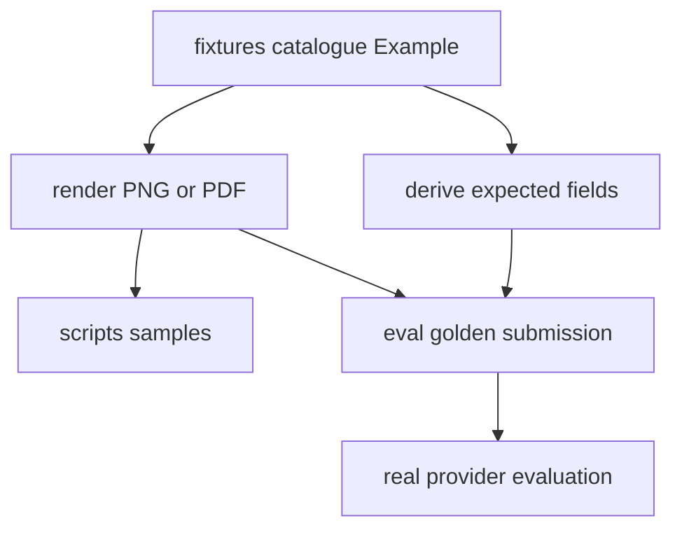

# Synthetic Fixtures and Golden Evaluation

The repository has two complementary quality systems. `tests/` uses `FakeModelProvider` and real API/queue/database/storage infrastructure for deterministic assertions. `eval/run_eval.py` runs the real Anthropic provider against generated golden documents and reports accuracy because model responses are probabilistic and billed. The fixture workflow is the canonical way to give [schema authoring](../schemas/registry-and-authoring.md) concrete examples without hand-maintaining expected outputs.

## One authoring model, two generated surfaces

`fixtures/catalogue.py:EXAMPLES` is the canonical table of `Example` objects. An example carries its document type/version, `Submission` faces, `Row`/`Table`/`Mrz`-like elements, declared absent fields, and optional golden/sample destinations. The renderer builds a visual document; expectation projection reads values from the same element arguments. Therefore rendered evidence and `expected.json` are co-derived rather than separately maintained.

The diagram reflects `fixtures/generate.py`, `fixtures/surfaces.py`, and expectation/render functions.

### Semantic rules

- Give each printed evidence value a keyword named for the schema field; list deliberately unprinted top-level values in `absent` so they project as `null` when schema semantics permit.
- `Table.into` projects nested arrays. Each nested property required by the schema must be represented; a missing printed column uses explicit `null`, not a missing key. This matters for invoice line items and VAT summaries.
- Use `fixtures.identifiers`, never realistic hand-written identifiers. It creates correctly shaped but deliberately invalid check-digit values, including ICAO-style MRZ check digits, avoiding accidental real identifiers while retaining extraction realism.
- MRZ names are transliterated before check-digit calculation. `fixtures.identifiers._transliterate` maps Hungarian letters with a single ICAO Doc 9303 §6.A transliteration (`Á É Í Ó Ő Ú Ű`) to one Latin letter, turns spaces and hyphens into `<`, and drops apostrophes. If a name contains a state-dependent or unwritable letter, including `Ö` or `Ü`, it raises `AmbiguousTransliteration`; choose a different synthetic holder name instead of guessing a zone Hungary may not print.
- The renderer refuses overflowing headings/cells/faces (`FixtureDoesNotFit`) and uses vendored DejaVu fonts so Hungarian accented text is distinguishable.
- `fixtures/render.py` is intentionally low-fidelity. The shared `card` geometry stacks labels uniformly, but `docs/research/hungarian-document-printed-labels.md` now records that real eID and address cards mix stacked, inline, right-aligned, and columnar placements on the same card. Treat this as a fidelity limitation, not an extraction/schema contract; measured extraction runs cited in the renderer docstring found no accuracy justification for widening the geometry yet.

Run `uv run python -m fixtures.generate` after data-table changes. It overwrites manual samples in `scripts/samples/` and golden submissions plus `expected.json` under `eval/golden/`. Do not edit generated image or expectation output independently.

`tests/test_fixture_renderer.py` verifies projection semantics, nested nulls, synthetic identifier invalidity, MRZ geometry and transliteration, refusal of ambiguous MRZ letters, font/layout determinism, schema conformance, and committed sample/golden drift. Run `uv run pytest tests/test_fixture_renderer.py` for fixture/schema change validation.

## External invoice layout reference workflow

`scripts/issue_demo_invoice_wizard.sh` is an interactive research aid for issuing one synthetic invoice through the public Számlázz.hu demófiók. It is not part of application runtime, does not submit to the API, and writes notes/PDF paths outside the repository by default under `$HOME/document-intelligence-reference/invoices/`. The wizard exists to collect layout evidence for invoice fixtures while policy work decides whether a provider-generated PDF can be committed.

The wizard's gates are part of the evidence contract: confirm the demófiók issuer is a placeholder before entering data, use the deliberately invalid synthetic buyer tax number from the committed invoice fixture, let the provider compute totals, download immediately because the public sandbox is wiped, and re-check the PDF for a `MINTA` watermark plus placeholder issuer. If any gate fails, stop and record the finding rather than adding the PDF as a fixture.

Change `scripts/issue_demo_invoice_wizard.sh` when the third-party UI, reference buyer data, or policy around external PDFs changes. Use `bash -n scripts/issue_demo_invoice_wizard.sh` as the narrow syntax check; actually running it is a manual browser workflow and should remain conditional. If a collected PDF becomes a committed fixture, route that follow-up through `fixtures/catalogue.py`, `fixtures/generate.py`, and the fixture drift tests above instead of adding a standalone expected file.

## Golden evaluation

`eval/run_eval.py` discovers every `expected.json` recursively, requires exactly one adjacent supported `submission.*`, creates a temporary submission/job in real PostgreSQL/S3, and calls `process_job` directly with `RetryingModelProvider(AnthropicModelProvider)`. It then reloads that job with documents and fields for scoring. A fully correct example must produce exactly one document, match expected classification type/version, and match every listed expected field; top-level numeric values tolerate ±0.01, while other values (including nested structures) compare exactly. It prints type and field accuracy and exits nonzero if any example is not fully correct.

Run `uv run python eval/run_eval.py` only with infrastructure, migrations, and a configured Anthropic credential; it performs billed external calls. `--model` and `--golden-dir` are explicit overrides. The committed golden set currently covers invoice v2 happy/simplified examples; the evaluation README records planned identity-document examples. This harness depends on the same provider/runtime setup described in [runtime configuration and validation](../operations/runtime-and-validation.md), but it is an accuracy report, not a deterministic replacement for tests.
