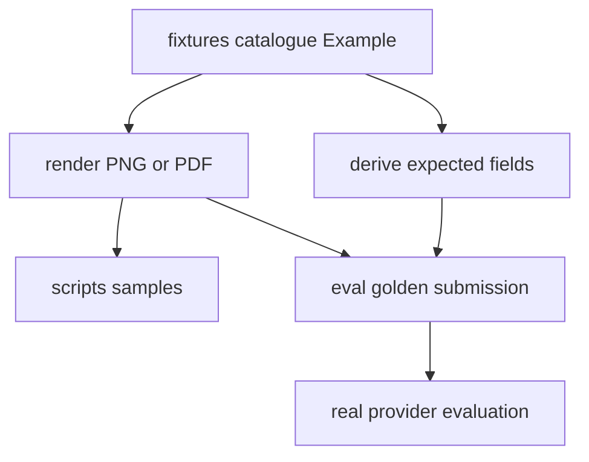

# Synthetic Fixtures and Golden Evaluation

The repository has two complementary quality systems. `tests/` uses `FakeModelProvider` and real API/queue/database/storage infrastructure for deterministic assertions. `eval/run_eval.py` runs the real Anthropic provider against generated golden documents and reports accuracy because model responses are probabilistic and billed.

## One authoring model, two generated surfaces

`fixtures/catalogue.py:EXAMPLES` is the canonical table of `Example` objects. An example carries its document type/version, `Submission` faces, `Row`/`Table`/`Mrz`-like elements, declared absent fields, and optional golden/sample destinations. The renderer builds a visual document; expectation projection reads values from the same element arguments. Therefore rendered evidence and `expected.json` are co-derived rather than separately maintained.

```mermaid
flowchart TD
  Catalogue["fixtures catalogue Example"] --> Render["render PNG or PDF"]
  Catalogue --> Expect["derive expected fields"]
  Render --> Sample["scripts samples"]
  Render --> Golden["eval golden submission"]
  Expect --> Golden
  Golden --> Eval["real provider evaluation"]
```

The diagram reflects `fixtures/generate.py`, `fixtures/surfaces.py`, and expectation/render functions.

### Semantic rules

- Give each printed evidence value a keyword named for the schema field; list deliberately unprinted top-level values in `absent` so they project as `null` when schema semantics permit.
- `Table.into` projects nested arrays. Each nested property required by the schema must be represented; a missing printed column uses explicit `null`, not a missing key. This matters for invoice line items and VAT summaries.
- Use `fixtures.identifiers`, never realistic hand-written identifiers. It creates correctly shaped but deliberately invalid check-digit values for Hungarian tax numbers, personal identifiers, bank account groups, and ICAO MRZ fields, avoiding accidental real identifiers while retaining extraction realism.
- MRZ names are transliterated through `fixtures.identifiers._transliterate`. It accepts the one-way Hungarian mappings recorded from ICAO Doc 9303 and specimens (`Á→A`, `É→E`, `Í→I`, `Ó→O`, `Ő→O`, `Ú→U`, `Ű→U`), converts spaces/hyphens to fillers, drops apostrophes, and raises `AmbiguousTransliteration` for state-dependent letters such as `Ö` and `Ü`. Fixture authors should choose a name without those letters rather than guessing a Hungarian issuing-state choice.
- Quote printed labels and date formats from `docs/research/hungarian-document-printed-labels.md`, especially §§6-7 and the Date formats section. That note now records that eID and address cards mix label placement modes, the driving licence has a rotated verso legend and no address field on captured specimens, and TD1 identity-card MRZ uses `I<` padding rather than `ID`.
- The renderer refuses overflowing headings/cells/faces (`FixtureDoesNotFit`) and uses vendored DejaVu fonts so Hungarian accented text is distinguishable. Current `CARD` and `SHEET` geometries are intentionally shared approximations: `CARD` stacks rows uniformly and cannot express mixed eID/address-card placement or the driving licence's rotated legend. Treat a renderer change as fidelity work, not a schema expectation change, unless a source-backed fixture field cannot be printed.

Run `uv run python -m fixtures.generate` after data-table changes. It overwrites manual samples in `scripts/samples/` and golden submissions plus `expected.json` under `eval/golden/`. Do not edit generated image or expectation output independently.

`tests/test_fixture_renderer.py` verifies projection semantics, nested nulls, synthetic identifier invalidity, MRZ geometry/transliteration/refusal behavior, font/layout determinism, schema conformance, fit refusal, and committed sample/golden drift. Run `uv run pytest tests/test_fixture_renderer.py` for fixture/schema change validation.

## External layout references

`scripts/issue_demo_invoice_wizard.sh` is a manual Számlázz.hu demófiók wizard for acquiring an external invoice layout reference. It is a quality reference workflow, not the runtime API or the [runtime validation path](../operations/runtime-and-validation.md): a human drives the third-party UI, the wizard records observations in `$HOME/document-intelligence-reference/invoices/demofiok-notes.env`, and the downloaded PDF is saved outside the repository until policy decides whether provider PDFs can be committed.

The wizard deliberately mirrors the `invoice/happy_path` buyer and two ordinary 27% line items so the provider PDF can be compared with the synthetic fixture layout, while leaving schema edge cases to the committed fixtures. Its safety gates require the issuer to be visibly a placeholder and ask the operator to record whether the PDF carries a `MINTA` watermark; if either gate fails, do not keep or commit the PDF. For script edits, validate syntax without running the workflow with `bash -n scripts/issue_demo_invoice_wizard.sh`; run the wizard itself only when intentionally collecting a fresh external reference.

## Golden evaluation

`eval/run_eval.py` discovers every `expected.json` recursively, requires exactly one adjacent supported `submission.*`, creates a temporary submission/job in real PostgreSQL/S3, and calls `process_job` directly with `RetryingModelProvider(AnthropicModelProvider)`. It then reloads that job with documents and fields for scoring. A fully correct example must produce exactly one document, match expected classification type/version, and match every listed expected field; top-level numeric values tolerate ±0.01, while other values (including nested structures) compare exactly. It prints type and field accuracy and exits nonzero if any example is not fully correct.

Run `uv run python eval/run_eval.py` only with infrastructure, migrations, and a configured Anthropic credential; it performs billed external calls. `--model` and `--golden-dir` are explicit overrides. The committed golden set currently covers invoice v2 happy/simplified examples; the evaluation README records planned identity-document examples. This harness is an accuracy report, not a deterministic replacement for tests.
