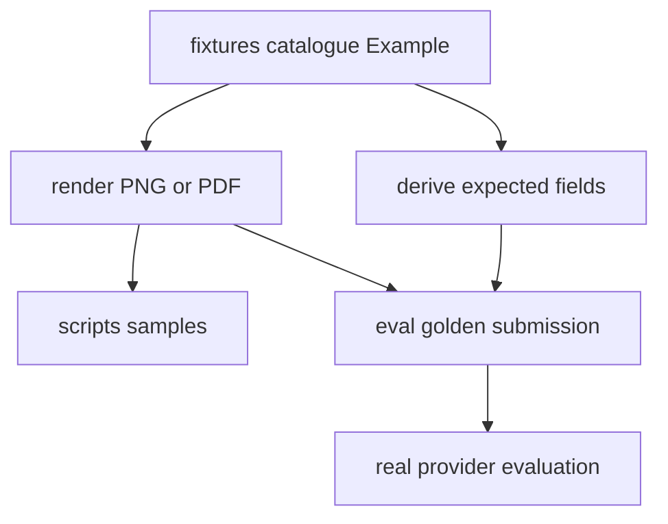

# Synthetic Fixtures and Golden Evaluation

The repository has two complementary quality systems. `tests/` uses `FakeModelProvider` and real API/queue/database/storage infrastructure for deterministic assertions. `eval/run_eval.py` runs the real Anthropic provider against generated golden documents and reports accuracy because model responses are probabilistic and billed.

## One authoring model, two generated surfaces

`fixtures/catalogue.py:EXAMPLES` is the canonical table of `Example` objects. An example carries its document type/version, `Submission` faces, `Row`/`Table`/`Mrz`-like elements, declared absent fields, and optional golden/sample destinations. The renderer builds a visual document; expectation projection reads values from the same element arguments. Therefore rendered evidence and `expected.json` are co-derived rather than separately maintained.

```mermaid
flowchart TD
  Catalogue["fixtures catalogue Example"] --> Render["render PNG or PDF"]
  Catalogue --> Expect["derive expected fields"]
  Render --> Sample["scripts samples"]
  Render --> Golden["eval golden submission"]
  Expect --> Golden
  Golden --> Eval["real provider evaluation"]
```

The diagram reflects `fixtures/generate.py`, `fixtures/surfaces.py`, and expectation/render functions.

### Semantic rules

- Give each printed evidence value a keyword named for the [schema registry](../schemas/registry-and-authoring.md) field; list deliberately unprinted top-level values in `absent` so they project as `null` when schema semantics permit.
- `Table.into` projects nested arrays. Each nested property required by the schema must be represented; a missing printed column uses explicit `null`, not a missing key. This matters for invoice line items and VAT summaries.
- Use `fixtures.identifiers`, never realistic hand-written identifiers. It creates correctly shaped but deliberately invalid check-digit values for tax numbers, personal identifiers, bank accounts, and ICAO-style MRZ fields, avoiding accidental real identifiers while retaining extraction realism.
- MRZ names are transliterated by `fixtures.identifiers` from the printed Hungarian name into the zone alphabet. Unambiguous ICAO 9303 §6.A Hungarian letters map to one ASCII letter (`Á→A`, `Ő→O`, `Ű→U`); spaces and hyphens become `<`; apostrophes are omitted. Characters with state-dependent MRZ choices such as `Ö` and `Ü` raise `AmbiguousTransliteration` instead of guessing.
- The renderer refuses overflowing headings/cells/faces (`FixtureDoesNotFit`) and uses vendored DejaVu fonts so Hungarian accented text is distinguishable. `fixtures/render.py` is intentionally low-fidelity: the shared `card` geometry stacks labels uniformly even though `docs/research/hungarian-document-printed-labels.md` records that real identity documents mix stacked, inline, right-aligned, columnar, and rotated label placements. Do not treat a per-document-type placement switch as sufficient evidence for faithful identity-card layout.

Run `uv run python -m fixtures.generate` after data-table changes. It overwrites manual samples in `scripts/samples/` and golden submissions plus `expected.json` under `eval/golden/`. Do not edit generated image or expectation output independently.

`tests/test_fixture_renderer.py` verifies projection semantics, nested nulls, synthetic identifier invalidity, MRZ transliteration and ambiguous-character refusal, font/layout determinism, schema conformance, and committed sample/golden drift. Run `uv run pytest tests/test_fixture_renderer.py` for fixture/schema change validation.

## Manual external layout references

`scripts/issue_demo_invoice_wizard.sh` is a human-operated research aid for obtaining a Számlázz.hu demófiók invoice PDF, not part of the deterministic fixture generation or application runtime. It guides a browser session, records observations in `$HOME/document-intelligence-reference/invoices/demofiok-notes.env` by default, and asks the human to save the PDF outside the working tree while the repository decision about committing provider PDFs remains open.

The wizard exists to compare a real provider layout with the synthetic invoice fixtures without introducing live customer data. Its gates require a placeholder issuer, use the same synthetic buyer values as the `invoice/happy_path` golden example, warn not to correct the deliberately invalid buyer tax-number check digit, check whether the resulting PDF carries a `MINTA` watermark, and stop if the PDF issuer looks real. Because the browser flow depends on a third-party JavaScript UI, validate changes to this script by reading/running the wizard manually; do not add it to the ordinary pytest or golden-evaluation path.

This manual workflow supports fixture fidelity decisions documented here, while [runtime validation](../operations/runtime-and-validation.md) remains the home for service startup checks and [HTTP API submission](../api/http-api.md) remains the consumer of committed samples.

## Golden evaluation

`eval/run_eval.py` discovers every `expected.json` recursively, requires exactly one adjacent supported `submission.*`, creates a temporary submission/job in real PostgreSQL/S3, and calls `process_job` directly with the [model provider](../model-provider/adapter-and-retries.md) stack `RetryingModelProvider(AnthropicModelProvider)`. It then reloads that job with documents and fields for scoring. A fully correct example must produce exactly one document, match expected classification type/version, and match every listed expected field; top-level numeric values tolerate ±0.01, while other values (including nested structures) compare exactly. It prints type and field accuracy and exits nonzero if any example is not fully correct.

Run `uv run python eval/run_eval.py` only with infrastructure, migrations, and a configured Anthropic credential; it performs billed external calls. `--model` and `--golden-dir` are explicit overrides. The committed golden set currently covers invoice v2 happy/simplified examples; the evaluation README records planned identity-document examples. This harness is an accuracy report, not a deterministic replacement for tests.
