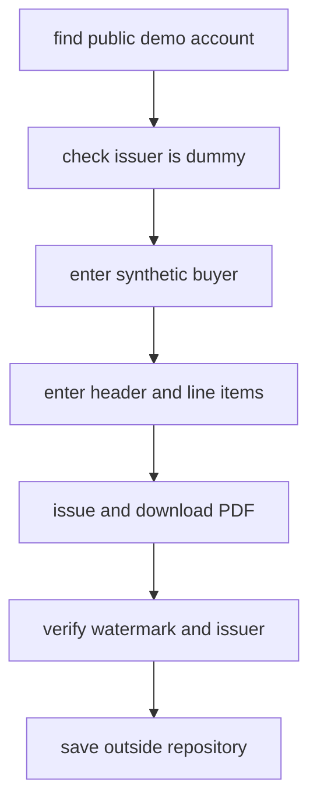

# Manual Reference Capture for Demo Invoices

`scripts/issue_demo_invoice_wizard.sh` is an interactive research workflow for issuing a synthetic invoice through the public Számlázz.hu demófiók. It supports invoice-layout evidence gathering for [synthetic fixtures and golden evaluation](fixtures-and-evaluation.md), but it is deliberately separate from committed fixture generation: the downloaded PDF is saved outside the repository until the product decision about provider PDFs is settled.

The diagram follows the seven stage calls in `scripts/issue_demo_invoice_wizard.sh`.

## What the wizard owns

The script wraps a reusable Bash wizard library around repository-specific stages. The library provides terminal clearing, progress banners, prompts, `ENV_FILE` upserts, and optional GitHub secret/variable helpers; this particular wizard uses those primitives to capture observations, not application credentials. By default it writes notes to `$HOME/document-intelligence-reference/invoices/demofiok-notes.env`, creates that directory if needed, and never writes into the project `.env` unless a caller overrides `ENV_FILE`.

The staged flow is intentionally human-in-the-loop because the third-party UI is JavaScript-rendered and the exact demo entry point is not stable enough to automate. The wizard records the URL reached, asks the operator to verify that the issuer block is a placeholder, enters the synthetic buyer and line items, downloads the PDF, then asks for PDF-level evidence such as the `MINTA` watermark and final file path.

## Safety and scope boundaries

- The buyer data is synthetic and mirrors the committed `invoice/happy_path` fixture shape, including a deliberately invalid Hungarian tax-number check digit. Do not correct that value; [fixture identifier helpers](fixtures-and-evaluation.md#mrz-and-privacy-identifiers) exist to keep public examples uncollidable.
- The issuer gate is mandatory. If the demófiók shows a real or recognizable issuer, the wizard exits and the resulting PDF must not be kept as synthetic evidence.
- The MINTA watermark check is a finding, not an automated assertion. If absent, record the result; do not silently strengthen fixture claims beyond observed evidence.
- The downloaded PDF is operational evidence outside version control, like PRADO captures referenced by `docs/research/hungarian-document-printed-labels.md`. The generated fixture surfaces still come from `fixtures/catalogue.py` and `uv run python -m fixtures.generate`.

## Change navigation

| Intent | Start here | Important symbols or stages | Focused validation |
| --- | --- | --- | --- |
| Change the operator UX or prompt persistence | `scripts/issue_demo_invoice_wizard.sh` wizard library before the `STAGES` marker | `banner`, `stage`, `ask`, `ask_secret`, `write_env`, `finish`, `ENV_FILE` | `bash -n scripts/issue_demo_invoice_wizard.sh` |
| Change the Számlázz.hu evidence-gathering procedure | `scripts/issue_demo_invoice_wizard.sh` stages section | `TOTAL_STAGES`, `TOTAL_MINUTES`, issuer gate, PDF gate, `PDF_PATH`, `SURPRISES` | Run the wizard manually in a disposable shell; keep captured files outside the repo |
| Align the captured invoice with generated fixtures | `fixtures/catalogue.py` invoice examples and this wizard's buyer/line-item stages | `EXAMPLES`, `invoice/happy_path`, buyer fields, line-item values | `uv run pytest tests/test_fixture_renderer.py` after fixture-table changes |

Escalate to [runtime configuration and validation](../operations/runtime-and-validation.md) only if a change starts or configures the FastAPI, worker, PostgreSQL, Redis, MinIO, or model-provider runtime. The wizard is not part of service startup and its default note file is not consumed by application code.
