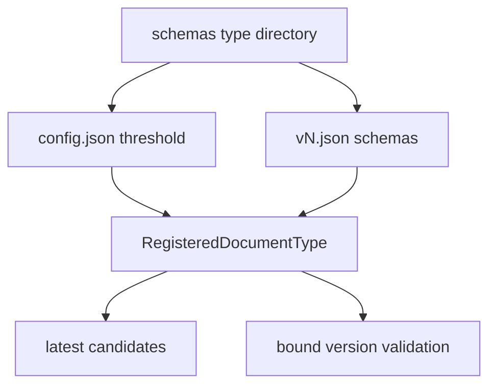

# Schema Registry and Document Type Authoring

`SchemaRegistry.load(directory)` treats every direct subdirectory as one document type. It requires `config.json` with a numeric `confidence_threshold` and at least one `vN.json`; `get(name)` returns the highest integer version and `get(name, version)` pins a version. `all_latest()` supplies one latest schema per type to classification. Loading errors are deliberate startup failures, not partial registration.

The registry supplies classification candidates and exact extraction validation targets.

## Version and threshold rules

Version comes only from the filename (`v1.json`, `v2.json`), not an in-schema field. A type's threshold is shared by all versions, not global or per version. Automated whole-document classification binds its returned type/version; extraction and extraction review use that exact bound version. Classification and every extracted field are compared against the same type threshold. A schema version is operator-immutable once used for processing; code cannot enforce that without historical database knowledge, so add a new `vN.json` rather than edit a live version.

## Current registry contents

| Directory | Versions | Purpose | Threshold |
| --- | --- | --- | --- |
| `schemas/invoice/` | `v1`, `v2` | commercial and simplified Hungarian invoices; v2 contains item lines, VAT summary, and totals | 0.8 |
| `schemas/hungarian_id_card/` | `v1` | Hungarian identity card, including optional CAN/MRZ | 0.9 |
| `schemas/hungarian_passport/` | `v1` | passport data page and two-line MRZ | 0.9 |
| `schemas/hungarian_driving_licence/` | `v1` | EU-style licence, including category table/restrictions | 0.9 |
| `schemas/hungarian_address_card/` | `v1` | address card, personal identifier, and both-face address data | 0.9 |

The JSON Schema descriptions are model instructions as well as validation; preserve their distinctions. Invoice v2 requires only core fields but encodes optional printed facts as nullable values. Its nested item/VAT rows require every nested property, using `null` when that printed row lacks a value. It intentionally preserves printed totals and VAT summaries rather than deriving/reconciling them. Identity schemas likewise distinguish verbatim fields, normalized date strings, optional physical-card features, and MRZ transcription.

## Adding or evolving a document type

1. Create `schemas/<name>/config.json` with an evidence-backed numeric threshold and `v1.json` valid JSON Schema with strong title/description/properties/required semantics.
2. Ensure classification descriptions distinguish neighboring types and extraction properties specify transcription/normalization/null behavior. Tool generation uses schema `properties` and source `required` exactly.
3. Load the registry in tests; verify `all_latest` candidate behavior and bound-version extraction if applicable.
4. Add synthetic fixtures/golden coverage through the [fixture workflow](../quality/fixtures-and-evaluation.md), not hand-authored expected files.
5. For a compatible evolution, add `vN.json`; do not mutate an active version.

`tests/test_schema_registry.py` covers loading, missing config/versions/JSON, lookup, latest selection, and threshold sharing. `tests/test_model_provider_anthropic.py` checks the generated tool requires only schema-required fields; `tests/test_extraction_validation.py` covers JSON Schema enforcement.
